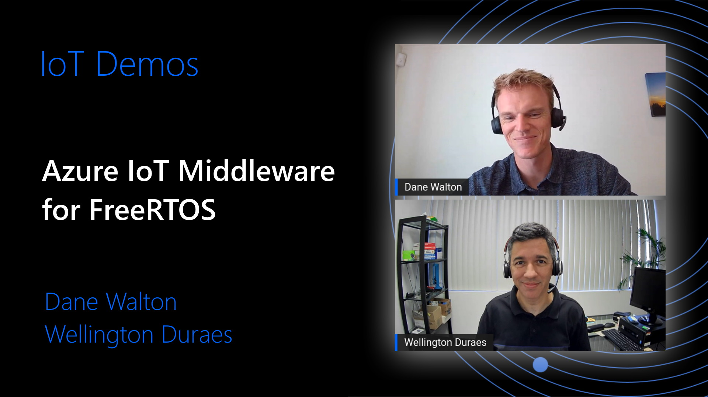
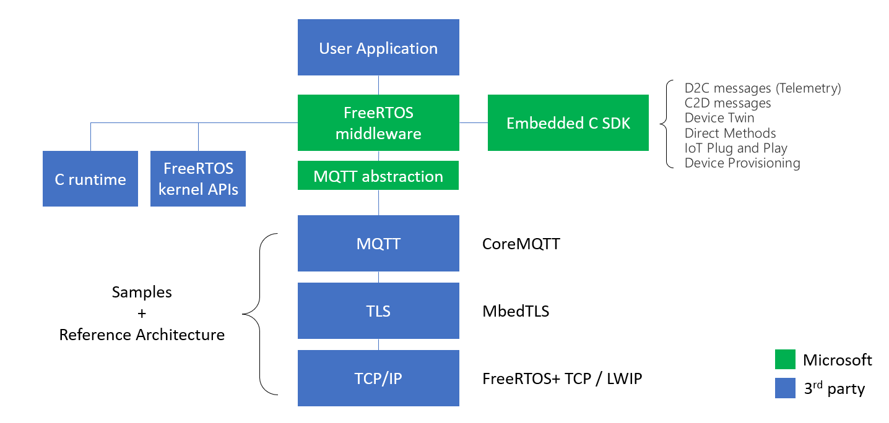

# Azure IoT Middleware for FreeRTOS 

[](https://github.com/Azure/azure-iot-middleware-freertos/actions/workflows/ci_tests_linux.yml)

The Azure IoT middleware for FreeRTOS simplifies the connection of devices running FreeRTOS to Azure IoT services. It builds on top of the [Azure SDK for Embedded C](https://github.com/Azure/azure-sdk-for-c) and adds MQTT client support. Below are key points of this project:

- The Azure IoT middleware for FreeRTOS is non allocating. That is, customers must allocate our data structures where they desire (global memory, heap, stack, etc.) and then pass the address of the allocated structure into our functions to initialize them and in order to perform various operations.
- The Azure IoT middleware for FreeRTOS operates at the MQTT level. Establishing the MQTT connection, subscribing and unsubscribing from topics, sending and receiving of messages, and disconnections are handled by the customer via middleware APIs.
- Customers control the TLS/TCP connection to the endpoint. This allows for flexibility between software or hardware implementations of either. For porting, please see the [porting](#porting) section below.
- No background threads are created by the Azure IoT middleware for FreeRTOS. Messages are sent and received synchronously.
- Retries with backoff are handled by the customer. FreeRTOS makes use of their own backoff and retry logic which customers are free to use (we demo this in our samples).

## Table of Contents

- [Azure IoT Middleware for FreeRTOS](#azure-iot-middleware-for-freertos)
  - [Table of Contents](#table-of-contents)
  - [Samples](#samples)
  - [Docs](#docs)
  - [Repo Structure](#repo-structure)
    - [Dependencies](#dependencies)
  - [Library Architecture](#library-architecture)
  - [Code Size](#code-size)
  - [Building](#building)
    - [Using CMake](#using-cmake)
    - [Using Source Files](#using-source-files)
    - [Using Amazon FreeRTOS](#using-amazon-freertos)
  - [Porting](#porting)
    - [TCP/IP and TLS](#tcpip-and-tls)
    - [MQTT](#mqtt)
    - [Port Application from Azure IoT C SDK](#port-application-from-azure-iot-c-sdk)
  - [Support](#support)
  - [Contributing](#contributing)
    - [Code Style](#code-style)
    - [License](#license)
  - [Trademarks](#trademarks)

## Samples

To keep this repo simple without board specific dependencies, we have a separate repo with all of the samples ([please see the link here for working samples](https://github.com/Azure-Samples/iot-middleware-freertos-samples)). There we have samples for several devices including:

|**Device** | **Azure IoT Hub** | **Azure IoT Device Provisioning** | **Azure Device Update** |
|---------|:----------:|:---------:|:---------:|
| STM32L475 | &check; | &check; | &check; |
| STM32L4+ | &check; | &check; | &check; |
| STM32H745 | &check; | &check; | &check; |
| NXP RT1060 | &check; | &check; | &check; |
| ESPRESSIF ESP32 | &check; | &check; | &check; |
| Linux | &check; | &check; | &check; |
| Windows | &check; | &check; | &cross; |

For a video deep dive into this repo and the samples, please see the Microsoft Developers video below.

[](https://youtu.be/PNykfuJ3VDs)

## Docs

We have published doxygen-generated documentation for all of our APIs. [Please see the link here to review how to use the APIs.](https://azure.github.io/azure-iot-middleware-freertos/)


### Azure Device Update

For details on using this library for over-the-air updates, please refer to this document: [How to use the ADU Agent Client in Azure IoT Middleware for FreeRTOS](./docs/how_to_use_adu_client.md).

## Repo Structure

This repo is built for integration into your project. As mentioned above, if you would like to try out our samples, please clone that repo to get started. Otherwise, this repo will allow you to integrate the Azure IoT middleware for FreeRTOS into your embedded project. To see how that integration works, please see our below sections for [building](#building).

The most relevant sections of the repo are the following:

- `/config_templates`: Template config files to use for the library. Provided to easily bootstrap your project with the middleware.
- `/libraries`: Submodule dependencies for the middleware. To initialize these after cloning, you can run:
  
    ```bash
    git submodule update --init
    ```

- `/ports`: The source code for the MQTT abstraction (currently coreMQTT). If you would like to create your own MQTT abstraction implementation, please see the [porting guide below](#mqtt).
- `/source`: All source files and headers for the middleware. To see how to build the project by using source files only, please see our below section for [source file building](#using-source-files).
- `/tests`: All unit and end-to-end tests used for validation.

### Dependencies

We have dependencies on two libraries under the `/libraries` directory: [Azure IoT SDK for Embedded C](https://github.com/Azure/azure-sdk-for-c) and [coreMQTT](https://github.com/FreeRTOS/coreMQTT). coreMQTT is used as a default MQTT implementation but may be swapped out by following [our porting guide below](#mqtt).

## Library Architecture

Below is a diagram showing the architecture for the middleware. Fundamentally, this middleware is build on top of the [Azure SDK for Embedded C](https://github.com/Azure/azure-sdk-for-c) and adds MQTT functionality to abstract one layer away for simplified application building. All green boxes are taken care of by the middleware and are supported by Microsoft, while blue boxes are up to the user. Please see the [porting section](#porting) for details on the blue boxes.

[](img)

## Code Size

Total library size can depend on feature usage. Rough approximations and averages from our samples are the following with `-Os` and no logging:

|**Features** | **Flash (text,rodata,data)** | **RAM1,RAM2(dss,data)** |
|---------|----------|---------|
| IoT Hub + DPS | 24 KB | 12 bytes
| IoT Hub only | 11.5 KB | 12 bytes

For total binary sizes for each of our samples, please see the "Size Chart" section in each of our [board specific readmes](https://github.com/Azure-Samples/iot-middleware-freertos-samples/#iot-hub-samples) on our samples repo.

## Building

**Please note that this repository does not clone FreeRTOS.** If using CMake, we require the user to pass build variables to point to FreeRTOS artifacts. If using other methods to build, we still require those artifacts to be available at compile time. Details are provided below for both scenarios.

### Using CMake

This repository uses `CMake` to build. To integrate into your project, use the `add_subdirectory()` CMake function in your `CMakeLists.txt` and pass three paths as CMake options. You can set these either in the configuration step of CMake with a `-D` or add them as cache variables in your CMake. [Please see here for an example from our samples](https://github.com/Azure-Samples/iot-middleware-freertos-samples/blob/be17acac1ef5d0c3d8d3f0539b0409dbcc69d0e7/CMakeLists.txt#L36-L42).

- `FREERTOS_DIRECTORY`: Full path to a directory which contains FreeRTOS ([as set up on GitHub](https://github.com/FreeRTOS/FreeRTOS)).
- `FREERTOS_PORT_DIRECTORY`: The full path to the freertos port that you would like to use. On GitHub you can find [the list here](https://github.com/FreeRTOS/FreeRTOS-Kernel/tree/main/portable). Locally, if you initialize the FreeRTOS submodules, you can find the options in `<FREERTOS_DIRECTORY>/FreeRTOS/Source/portable`
- `CONFIG_DIRECTORY`: The full path which has the following files: `FreeRTOSConfig.h`, `azure_iot_config.h`, and `core_mqtt_config.h`.

With those options added, the following CMake target will be available to integrate into your project:

- `az::iot_middleware::freertos`

### Using Source Files

Similar to the process of building using CMake, the library requires a few components in order to build by using only the source files (maybe in make files or some proprietary build system).

The following files are for core library functionality:

- All source files under `source`
- All header files under `source/include`
- All header files under `source/interface`

The following includes must be available to the library for compilation.

- FreeRTOS kernel includes
- A FreeRTOS port directory
- A path or paths to the following files: `FreeRTOSConfig.h`, `azure_iot_config.h`.

If using the coreMQTT port for the MQTT, the following needs to be included and built:

- `core_mqtt_config.h`
- The `source/interface` directory
- The port files in `ports/coreMQTT`
- Proper compilation and linking of the coreMQTT library

Other than these, your choice of libraries for TLS and TCP/IP are up to you to choose and properly configure/compile.

### Using Amazon FreeRTOS

We have a guide [here](./docs/amazon_freertos_port.md) which will help you port and build your Amazon FreeRTOS project with the Azure IoT middleware for FreeRTOS.

## Porting

This library, by depending on FreeRTOS, will support any board with a FreeRTOS port. FreeRTOS networking stack support is not as extensive as the OS and therefore may need to be created or adapted to work with our library. You may use available resources at the [FreeRTOS Plus repo](https://github.com/FreeRTOS/FreeRTOS-Plus-TCP) and the [FreeRTOS Third Party section](https://github.com/FreeRTOS/FreeRTOS/tree/main/FreeRTOS-Plus/Source/Application-Protocols/network_transport/freertos_plus_tcp) for integration. Please see the below sections for help with networking.

### TCP/IP and TLS

The middleware for FreeRTOS operates at the MQTT level. This requires customers to supply the TLS and TCP/IP stacks for their devices. The binding between the MQTT layer and the TLS/TCP/IP is defined in the [azure_iot_transport_interface.h](https://github.com/Azure/azure-iot-middleware-freertos/blob/main/source/interface/azure_iot_transport_interface.h). For an example to see how that is passed to the middleware, [please see the code block linked here in our samples](https://github.com/Azure-Samples/iot-middleware-freertos-samples/blob/ddb3c6970a2b837b73e60e0d3704ba7346d10c3f/demos/sample_azure_iot/sample_azure_iot.c#L353-L370).

#### Authentication

Azure IoT supports x509 certificate and SAS key authentication. For details on which to use, you can refer to [this document going over the pros and cons of each](https://azure.microsoft.com/blog/iot-device-authentication-options/). For more details on the TLS requirements of Azure IoT (TLS versions, certificate requirements, supported crypto algorithms, etc), [please see this document here](https://docs.microsoft.com/azure/iot-hub/iot-hub-tls-support). Application integration hints for both authentication mechanisms can be found in our samples: for [x509 please see here](https://github.com/Azure-Samples/iot-middleware-freertos-samples/blob/e88539df5e628caa44640dc5ce97079ab87d1327/demos/sample_azure_iot/sample_azure_iot.c#L271-L285) and for [SAS keys please see here](https://github.com/Azure-Samples/iot-middleware-freertos-samples/blob/e88539df5e628caa44640dc5ce97079ab87d1327/demos/sample_azure_iot/sample_azure_iot.c#L374-L380).

### MQTT

THIS FEATURE IS IN PREVIEW AND THE API IS SUBJECT TO CHANGE

The middleware uses an MQTT abstraction to allow the substitution of the MQTT library. The default implementation is the FreeRTOS built [coreMQTT](https://github.com/FreeRTOS/coreMQTT) (see the port implementation [here](https://github.com/Azure/azure-iot-middleware-freertos/tree/main/ports/coreMQTT)). If you would like to create a new MQTT abstraction implementation for an MQTT library of your choosing, please complete the interface described [in this header file](https://github.com/Azure/azure-iot-middleware-freertos/blob/main/source/interface/azure_iot_mqtt.h).

### Port Application from Azure IoT C SDK

If you are looking to port your application from the [Azure IoT C SDK](https://github.com/Azure/azure-iot-sdk-c), please see our document detailing the process here: [Porting from Azure IoT C SDK](./docs/azure_iot_c_sdk_port.md).

## Support

If you need support, please see our [SUPPORT.md](./SUPPORT.md) file.

## Contributing

This project welcomes contributions and suggestions.  Most contributions require you to agree to a
Contributor License Agreement (CLA) declaring that you have the right to, and actually do, grant us
the rights to use your contribution. For details, visit https://cla.opensource.microsoft.com.

When you submit a pull request, a CLA bot will automatically determine whether you need to provide
a CLA and decorate the PR appropriately (e.g., status check, comment). Simply follow the instructions
provided by the bot. You will only need to do this once across all repos using our CLA.

This project has adopted the [Microsoft Open Source Code of Conduct](https://opensource.microsoft.com/codeofconduct/).
For more information see the [Code of Conduct FAQ](https://opensource.microsoft.com/codeofconduct/faq/) or
contact [opencode@microsoft.com](mailto:opencode@microsoft.com) with any additional questions or comments.

### Code Style

This repository uses `uncrustify` to enforce coding style. The config in the root (`uncrustify.cfg`) is the same as in the FreeRTOS repo.

Note that different versions of `uncrustify` can produce differently rendered files. For that reason, just as the FreeRTOS repo has declared, we use version 0.67 of `uncrustify`. For installation instructions for `uncrustify`, please see their repo [here](https://github.com/uncrustify/uncrustify). Once you have that installed, you can make sure your contributions are rendered correctly by running our uncrustify script:

```bash
# From the repo root
./.github/scripts/code_style.sh fix
```

### License

Azure IoT middleware for FreeRTOS is licensed under the [MIT](https://github.com/Azure/azure-sdk-for-c/blob/main/LICENSE) license.

## Trademarks

This project may contain trademarks or logos for projects, products, or services. Authorized use of Microsoft 
trademarks or logos is subject to and must follow 
[Microsoft's Trademark & Brand Guidelines](https://www.microsoft.com/en-us/legal/intellectualproperty/trademarks/usage/general).
Use of Microsoft trademarks or logos in modified versions of this project must not cause confusion or imply Microsoft sponsorship.
Any use of third-party trademarks or logos are subject to those third-party's policies.
