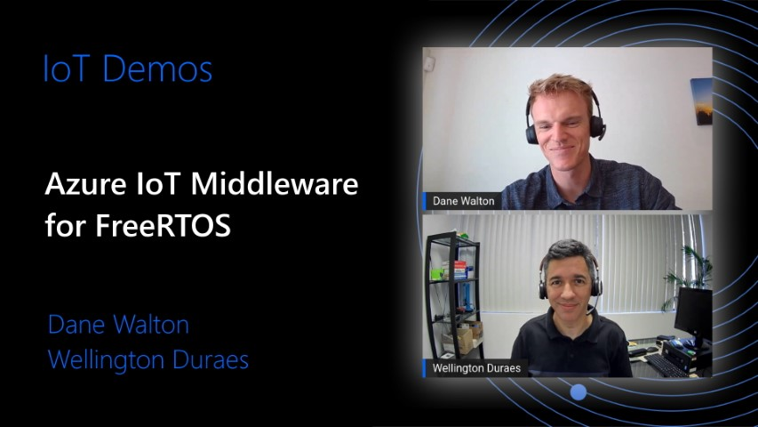

# Azure IoT middleware for FreeRTOS 

[](https://github.com/Azure/azure-iot-middleware-freertos/actions/workflows/ci_tests_linux.yml)

The Azure IoT middleware for FreeRTOS simplifies the connection of devices running FreeRTOS to Azure IoT services. It builds on top of the [Azure SDK for Embedded C](https://github.com/Azure/azure-sdk-for-c) and adds MQTT client support. Below are key points of this project:

- The Azure IoT middleware for FreeRTOS operates at the MQTT level. Establishing the MQTT connection, subscribing and unsubscribing from topics, sending and receiving of messages, and disconnections are handled by the customer via middleware APIs.
- Customers control the TLS/TCP connection to the endpoint. This allows for flexibility between software or hardware implementations of either. For porting, please see the [porting](#porting) section below.
- No background threads are created by the Azure IoT middleware for FreeRTOS. Messages are sent and received synchronously.
- Retries with backoff are handled by the customer. FreeRTOS makes use of their own backoff and retry logic which customers are free to use (we demo this in our samples).

## Repo Structure

This repo contains the Azure IoT middleware for FreeRTOS libraries and has dependencies only on coreMQTT. For working samples please visit the [samples repo](https://github.com/Azure-Samples/iot-middleware-freertos-samples). There we have samples for several devices including:

- STM32L475
- STM32L4+
- STM32H745
- NXP RT1060
- ESPRESSIF ESP32
- Linux
- Windows

For a video deep dive into this repo and the samples, please see the Microsoft Developers video below.

[](https://youtu.be/PNykfuJ3VDs)

## Building

### Using CMake

This repository uses `CMake` to build. To integrate into your project, it requires three paths. You can set these either in the configuration step of CMake with a `-D` or add them as cache variables in your CMake.

- `FREERTOS_DIRECTORY`: Full path to a directory which contains FreeRTOS ([as set up on GitHub](https://github.com/FreeRTOS/FreeRTOS)).
- `FREERTOS_PORT_DIRECTORY`: The full path to the freertos port that you would like to use. On GitHub you can find [the list here](https://github.com/FreeRTOS/FreeRTOS-Kernel/tree/main/portable). Locally, if you initialize the FreeRTOS submodules, you can find the options in `<FREERTOS_DIRECTORY>/FreeRTOS/Source/portable`
- `CONFIG_DIRECTORY`: The full path which has the following files: `FreeRTOSConfig.h`, `azure_iot_config.h`, and `core_mqtt_config.h`.

With those options added, the following CMake target will be available to integrate into your project:

- `az::iot_middleware::freertos`

### Using Source Files

Similar to the process of building using CMake, the library requires a few components in order to build by using only the source files (maybe in make files or some proprietary build system).

The following files are for core library functionality:

- All source files under `source`
- All header files under `source/include`
- All header files under `source/interface`

The following includes must be available to the library for compilation.

- FreeRTOS kernel includes
- A FreeRTOS port directory
- A path or paths to the following files: `FreeRTOSConfig.h`, `azure_iot_config.h`.

If using the coreMQTT port for the MQTT, the following needs to be included and built:

- `core_mqtt_config.h`
- The `source/interface` directory
- The port files in `ports/coreMQTT`
- Proper compilation and linking of the coreMQTT library

Other than these, your choice of libraries for TLS and TCP/IP are up to you to choose and properly configure/compile.

## Porting

### TCP/IP and TLS

The middleware for FreeRTOS operates at the MQTT level. This requires customers to supply the TLS and TCP/IP stacks for their devices. The binding between the MQTT layer and the TLS/TCP/IP is defined in the [azure_iot_transport_interface.h](https://github.com/Azure/azure-iot-middleware-freertos/blob/main/source/interface/azure_iot_transport_interface.h). For an example to see how that is passed to the middleware, [please see the code block linked here in our samples](https://github.com/Azure-Samples/iot-middleware-freertos-samples/blob/ddb3c6970a2b837b73e60e0d3704ba7346d10c3f/demos/sample_azure_iot/sample_azure_iot.c#L353-L370).

### MQTT

The middleware uses an MQTT abstraction to allow the substitution of the MQTT library. The default implementation is the FreeRTOS built [coreMQTT](https://github.com/FreeRTOS/coreMQTT) (see the port implementation [here](https://github.com/Azure/azure-iot-middleware-freertos/tree/main/ports/coreMQTT)). If you would like to create a new MQTT abstraction implementation for an MQTT library of your choosing, please complete the interface described [in this header file](https://github.com/Azure/azure-iot-middleware-freertos/blob/main/source/interface/azure_iot_mqtt.h).

## Contributing

This project welcomes contributions and suggestions.  Most contributions require you to agree to a
Contributor License Agreement (CLA) declaring that you have the right to, and actually do, grant us
the rights to use your contribution. For details, visit https://cla.opensource.microsoft.com.

When you submit a pull request, a CLA bot will automatically determine whether you need to provide
a CLA and decorate the PR appropriately (e.g., status check, comment). Simply follow the instructions
provided by the bot. You will only need to do this once across all repos using our CLA.

This project has adopted the [Microsoft Open Source Code of Conduct](https://opensource.microsoft.com/codeofconduct/).
For more information see the [Code of Conduct FAQ](https://opensource.microsoft.com/codeofconduct/faq/) or
contact [opencode@microsoft.com](mailto:opencode@microsoft.com) with any additional questions or comments.

### Code Style

This repository uses `uncrustify` to enforce coding style. The config in the root (`uncrustify.cfg`) is the same as in the FreeRTOS repo.

Note that different versions of `uncrustify` can produce differently rendered files. For that reason, just as the FreeRTOS repo has declared, we use version 0.67 of `uncrustify`. For installation instructions for `uncrustify`, please see their repo [here](https://github.com/uncrustify/uncrustify). Once you have that installed, you can make sure your contributions are rendered correctly by running our uncrustify script:

```bash
# From the repo root
./.github/scripts/code_style.sh fix
```

## Trademarks

This project may contain trademarks or logos for projects, products, or services. Authorized use of Microsoft 
trademarks or logos is subject to and must follow 
[Microsoft's Trademark & Brand Guidelines](https://www.microsoft.com/en-us/legal/intellectualproperty/trademarks/usage/general).
Use of Microsoft trademarks or logos in modified versions of this project must not cause confusion or imply Microsoft sponsorship.
Any use of third-party trademarks or logos are subject to those third-party's policies.
