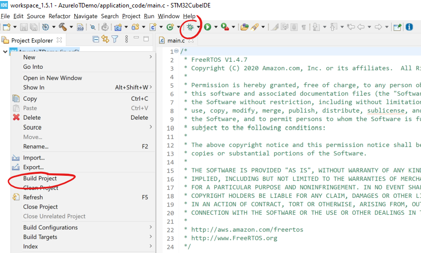

# Sample on STML475 Discovery Board

## Download Programs

[Download the IDE here.](https://www.st.com/en/development-tools/stm32cubeide.html)
[Download Termite here.](https://www.compuphase.com/software_termite.htm) (Or feel free to use any serial viewer you like.)

## Update Device Credentials

In [demo_config.h](../sample_azure_iot_embedded_sdk/common/demo_config.h), update the following values for either DPS or IoT Hub:

### DPS

- `democonfigENDPOINT`
- `democonfigID_SCOPE`
- `democonfigREGISTRATION_ID`
- `democonfigDEVICE_SYMMETRIC_KEY` OR `democonfigCLIENT_CERTIFICATE_PEM` and `democonfigCLIENT_PRIVATE_KEY_PEM`

### IoT Hub

- `democonfigDEVICE_ID`
- `democonfigHOSTNAME`
- `democonfigDEVICE_SYMMETRIC_KEY` OR `democonfigCLIENT_CERTIFICATE_PEM` and `democonfigCLIENT_PRIVATE_KEY_PEM`

## Update Device WiFi Credentials

Update the WiFi SSID and password in [main.c](../Common/stm32l4_l4+/main.c)

- `WIFI_SSID`
- `WIFI_PASSWORD`

## Build and Run

You can right click on the project to build and then select the bug icon in the top toolbar to debug the sample. You can then view the output from the device on the serial port by finding the correct COM port of your device and setting the BAUD to `115200`.



## Generating a Cert

If you need a working x509 certificate to get the samples working please see the following:

```bash
openssl ecparam -out device_ec_key.pem -name prime256v1 -genkey
openssl req -new -days 30 -nodes -x509 -key device_ec_key.pem -out device_ec_cert.pem -config x509_config.cfg -subj "/CN=azure-freertos-device"
openssl x509 -noout -text -in device_ec_cert.pem

rm -f device_cert_store.pem
cat device_ec_cert.pem device_ec_key.pem > device_cert_store.pem

openssl x509 -noout -fingerprint -in device_ec_cert.pem | sed 's/://g'| sed 's/\(SHA1 Fingerprint=\)//g' | tee fingerprint.txt
```

This will output a self signed client certificate with a private key. The `fingerprint.txt` is for your convenience when adding the device in IoT Hub and it asks for a Primary and Secondary Fingerprint. This value can be used for both fields.

## Troubleshooting

> Debugger complains about ST-Link or J-Link

There is a program [here](https://www.segger.com/downloads/jlink#STLink_Reflash) which can help you switch between ST-Link and J-Link debugging for your STM32L475. You can also feel free to switch debuggers in the STCube IDE by toggling at `Run -> Debug Configurations -> Debugger -> Debug Probe`


> WiFi issues in general

Please make sure the device's WiFi module is up to date with this `bin` here:

[Inventek ISM 43362 Wi-Fi module firmware update](https://www.st.com/resource/en/utilities/inventek_fw_updater.zip).
