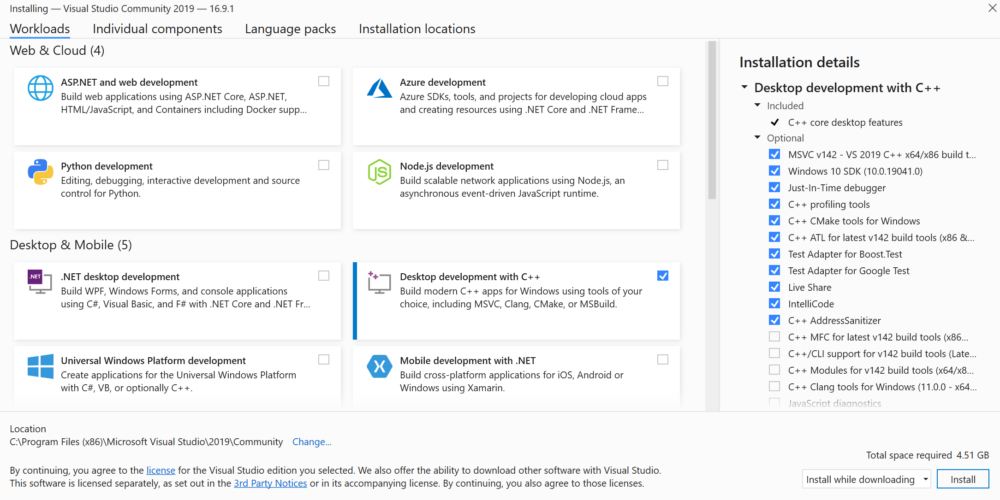

# Sample on Windows

## Download Programs

- [Download Visual Studio here](https://visualstudio.microsoft.com/downloads/)
  - Make sure to have the C++ build tools installed with your installation.
  

## Sample Authentication and Configuration

Authentication values will be updated in the [demo_config.h](./demo/sample_azure_iot_embedded_sdk/demo_config.h) file.

For either Provisioning or IoT Hub samples, SAS key and X509 authentication are supported. Update either `democonfigDEVICE_SYMMETRIC_KEY` for symmetric key or client side certificate `democonfigCLIENT_CERTIFICATE_PEM` and `democonfigCLIENT_PRIVATE_KEY_PEM` for certificates. **Note: only one auth mechanism can be used at a time and the other unused macros should be commmented out.**

If you need help generating a cert and private key, see the below [Generating a Cert](#generating-a-cert) section.

If you would like to use Device Provisioning, update the following values:

- `democonfigENDPOINT`
- `democonfigID_SCOPE`
- `democonfigREGISTRATION_ID`

If you would like to connect straight to IoT Hub, comment out `democonfigENABLE_DPS_SAMPLE` and update the following values:

- `democonfigDEVICE_ID`
- `democonfigHOSTNAME`

## Running the Sample 

After updating the authentication and values, you can open the VS solution [here](../sample_azure_iot_embedded_sdk/windows/sample_azure_iot_embedded_sdk.sln). Build the solution and run!

**Note:** If the demo fails due to an unchosen network configuration, choose the appropriate one from the list in the terminal and change the value [here](https://github.com/Azure/azure-iot-middleware-freertos/blob/3b94096a1ec71be44833565db0e9efb7d150da41/demo/sample_azure_iot_embedded_sdk/windows/FreeRTOSConfig.h#L138).

## Generating a Cert

If you need a working x509 certificate to get the samples working please see the following:

```bash
openssl ecparam -out device_ec_key.pem -name prime256v1 -genkey
openssl req -new -days 30 -nodes -x509 -key device_ec_key.pem -out device_ec_cert.pem -config x509_config.cfg -subj "/CN=azure-freertos-device"
openssl x509 -noout -text -in device_ec_cert.pem

rm -f device_cert_store.pem
cat device_ec_cert.pem device_ec_key.pem > device_cert_store.pem

openssl x509 -noout -fingerprint -in device_ec_cert.pem | sed 's/://g'| sed 's/\(SHA1 Fingerprint=\)//g' | tee fingerprint.txt
```

This will output a self signed client certificate with a private key. The `fingerprint.txt` is for your convenience when adding the device in IoT Hub and it asks for a Primary and Secondary Fingerprint. This value can be used for both fields.
