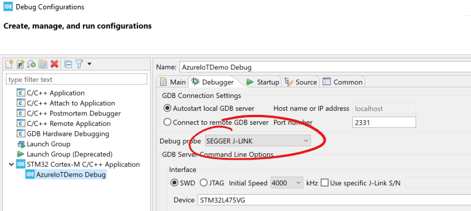

# Run Demo on STM32L475-Discovery board

## Update Device Credentials

In [demo_config.h](../common/demo_config.h), update the following values for either DPS or IoT Hub:

### DPS

- `ENDPOINT`
- `ID_SCOPE`
- `REGISTRATION_ID`
- `DEVICE_SYMMETRIC_KEY` OR `democonfigCLIENT_CERTIFICATE_PEM` and `democonfigCLIENT_PRIVATE_KEY_PEM`

### IoT Hub

- `DEVICE_ID`
- `HOSTNAME`
- `DEVICE_SYMMETRIC_KEY` OR `democonfigCLIENT_CERTIFICATE_PEM` and `democonfigCLIENT_PRIVATE_KEY_PEM`

## Update Device WiFi Credentials

Update the WiFi SSID and password in [main.c](../../Common/stm32l475/main.c)

- `WIFI_SSID`
- `WIFI_PASSWORD`

## Troubleshooting

> Debugger complains about ST-Link or J-Link

There is a program [here](https://www.segger.com/downloads/jlink#STLink_Reflash) which can help you switch between ST-Link and J-Link debugging for your STM32L475. You can also feel free to switch debuggers in the STCube IDE by toggling at `Run -> Debug Configurations -> Debugger -> Debug Probe`

> WiFi issues in general

Please make sure the device's WiFi module is up to date with this `bin` here:

[Inventek ISM 43362 Wi-Fi module firmware update](https://www.st.com/resource/en/utilities/inventek_fw_updater.zip).
