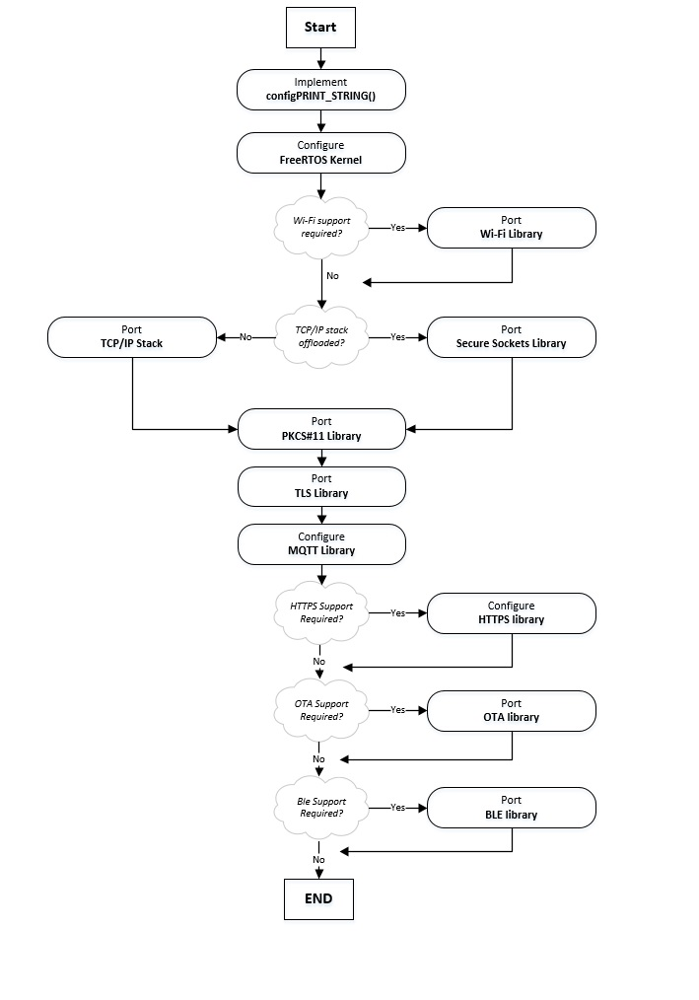

# Comparison with Amazon FreeRTOS/Core FreeRTOS

## Connection and Auth Comparisons

- Amazon FreeRTOS has a porting layer for "Secure Sockets" and a porting layer for "TLS".
- The TLS is for concrete TLS libraries (wolfSSL, mbedTLS, on chip TLS, etc).
- The Secure Sockets is the interface which their "convenience layer" calls into to connect to endpoints.
Side note: they also have PAL's for Wi-Fi, PKCS11.

- Core FreeRTOS lacks the "all encompasing" nature of the Secure Sockets library and instead takes dependency on mbedTLS and FreeRTOS + TCP.
  - [Link here to the "using mbedtls"](https://github.com/FreeRTOS/FreeRTOS/tree/master/FreeRTOS-Plus/Source/Application-Protocols/network_transport/freertos_plus_tcp/using_mbedtls) header and source. There is a version for mbedtls with pkcs11 support as well. Link [here to an example of the usage along with MQTT](https://github.com/FreeRTOS/FreeRTOS/blob/492ac6edb2fbf840d700410754e0bda9e7bfa504/FreeRTOS-Plus/Demo/coreMQTT_Windows_Simulator/MQTT_Basic_TLS/DemoTasks/BasicTLSMQTTExample.c#L540-L545).

## Amazon FreeRTOS Porting

### TLS Porting

- [Link to TLS porting details.](https://docs.aws.amazon.com/freertos/latest/portingguide/afr-porting-tls.html)
- Details in iot_tls.h
- User implementation goes in iot_tls.c.

### Secure Sockets Porting

- [Link to Secure Sockets porting details.](https://docs.aws.amazon.com/freertos/latest/portingguide/afr-porting-ss.html)
- This is essentially their convenience layer for TLS connections. It encompasses all of the networking and authentication pieces into one place.
  - Example [here which someone would call](https://github.com/danewalton/azure-freertos/blob/6835d78e2c08da617b511ca3c157b1b2c8be7248/libraries/abstractions/transport/secure_sockets/transport_secure_sockets.c#L478-L519) and [here for that used in coreMQTT demo](https://github.com/danewalton/azure-freertos/blob/6835d78e2c08da617b511ca3c157b1b2c8be7248/demos/coreMQTT/mqtt_demo_mutual_auth.c#L603-L605) using mutual auth.
- They have secure socket for lwip, FreeRTOS+TCP, and many boards which have offloaded TCP/IP on Wi-Fi like the STM32L475 Discovery.

### PKCS11 Porting

- [Link to Porting PKCS11 Library](https://docs.aws.amazon.com/freertos/latest/portingguide/afr-porting-pkcs.html)
- Purpose
  - Signing and verifying.
  - Storage and enumeration of X.509 certificates.
  - Storage and management of cryptographic keys.
- While storing keys in regular flash is easy for prototyping, not suitable for production scenarios.
This API, to be ported to each hardware, formalizes the process of using dedicated crypto hardware in the authentication process

### Overall Porting Guide for Amazon FreeRTOS

## Core FreeRTOS Porting

### TLS

- From their website: "FreeRTOS uses either mbedTLS or an off-chip TLS implementation …. FreeRTOS includes a port of mbedTLS.
- Other TLS libraries are accessed through a TLS abstraction layer.
- FreeRTOS has a sample with WolfSSL in their repo (however doesn't use MQTT).
  - [The Embedded Repo has an example using OpenSSL](https://github.com/aws/aws-iot-device-sdk-embedded-C/blob/e8e79f5bd6078a04946f67e1fbdbb4824cdf74d4/demos/mqtt/mqtt_demo_basic_tls/mqtt_demo_basic_tls.c#L450)

### TLS Usage

- The connection to the endpoint is a two step process.
- First you establish a TLS connection to the server via TLS_FreeRTOS_Connect()
  - This takes in things like a context, endpoint, port, network credentials, and timeouts.
  - They have a backoff and sleep utility to help with retrying this connection.
- Once the TLS is established, you connect to the MQTT broker.
  - [The MQTT layer has a recv and send v-table to fill in to a network transport struct (along with a context for that TLS stack).](https://github.com/FreeRTOS/FreeRTOS/blob/3dc4516ea1e72bf485e19ed0653dac543425158d/FreeRTOS-Plus/Demo/coreMQTT_Windows_Simulator/MQTT_Basic_TLS/DemoTasks/BasicTLSMQTTExample.c#L544-L546)
