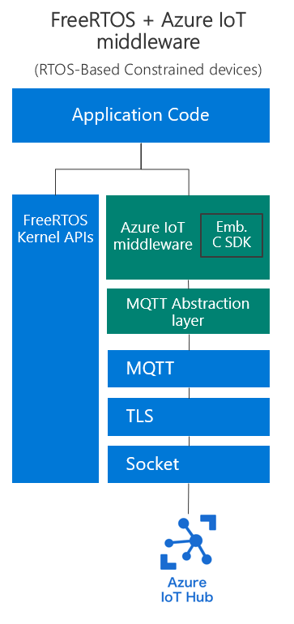

# Porting from Azure IoT C SDK to Azure middleware for FreeRTOS

If you are using FreeRTOS, Microsoft highly recommends using the Azure IoT middleware for FreeRTOS instead of the [Azure IoT C SDK](https://github.com/Azure/azure-iot-sdk-c). Both SDKs were built with different intentions and concentrations, leading to different architectures and therefore necessary application approaches written by users. This document explains the benefits of using the Azure IoT middleware for FreeRTOS and steps you can take to port from an existing Azure IoT C SDK application.

In this Article

- [Architectures](#architectures)
- [Application Code for Azure IoT Hub](#application-code-for-azure-iot-hub)
  - [Initialization](#initialization)
  - [Sending Telemetry](#sending-telemetry)
  - [Other IoT Hub Features](#other-iot-hub-features)
- [Application Code for Azure IoT Device Provisioning](#application-code-for-azure-iot-device-provisioning)
  - [Initialization](#initialization-1)
  - [Device Registration](#device-registration)
- [Error Handling](#error-handling)
- [Threads](#threads)
- [Retry and Reconnect](#retry-and-reconnect)
- [Function Mappings](#function-mappings)
  - [Azure IoT Hub Client](#azure-iot-hub-client)
  - [Azure IoT Provisioning Client](#azure-iot-provisioning-client)

## Architectures

Below shows the high-level differences in architectures between the two SDKs. Notice that all **green** boxes are handled and supported by Microsoft, while all **blue** boxes are handled by the user.

 

From the above pictures, a few key points should be kept in mind.

| Azure IoT C SDK | Azure IoT middleware for FreeRTOS |
| --------------- | --------------------------------- |
| Developed to be a vertically integrated stack (transport, TLS, TCP/IP) and handling of all Azure IoT features. | Developed to handle Azure IoT features and MQTT connections. TLS and TCP/IP are handled by the user application. |
| Developed to support different operating systems. | Developed to support one platform/OS (FreeRTOS). |
| Supports three transport layers (MQTT, AMQP, and HTTP). | Supports only MQTT. |

With that, the Azure IoT middleware for FreeRTOS gives you the following benefits:

- Increased performance.
- Reduced code size.
- A very thin networking abstraction between MQTT and TLS for an uninhibited "bring-your-own" networking stack experience.
- No calls to `malloc()` for potential deterministic integration.

An example scenario might be choosing the default coreMQTT layer, mbed TLS for the TLS layer, and lwIP for the TCP/IP. The TLS and TCP/IP are the layers which the developer must compose themselves. An example of that configuration is [here with our STM32H745I-DISCO board demo](https://github.com/Azure-Samples/iot-middleware-freertos-samples/tree/main/demos/projects/ST/stm32h745i-disco/cm7).

## Application Code for Azure IoT Hub

Let's look at some basic application-level code for using Azure IoT Hub. While the FreeRTOS middleware code below is somewhat more complicated for the application developer to setup than the Azure IoT C SDK equivalent, it should still be straightforward. The small amount of complexity added to your application gives you much greater control using considerably fewer resources.

### Initialization

#### Azure IoT C SDK

[Taken from the iothub_ll_telemetry_sample](https://github.com/Azure/azure-iot-sdk-c/blob/master/iothub_client/samples/iothub_ll_telemetry_sample/iothub_ll_telemetry_sample.c):

```c
(void)IoTHub_Init();

IOTHUB_DEVICE_CLIENT_LL_HANDLE device_ll_handle;

// Create the iothub handle here
device_ll_handle = IoTHubDeviceClient_LL_CreateFromConnectionString(connectionString, MQTT_Protocol);

```

#### Azure IoT middleware for FreeRTOS

[Taken from the sample_azure_iot sample](https://github.com/Azure-Samples/iot-middleware-freertos-samples/blob/main/demos/sample_azure_iot/sample_azure_iot.c):

```c
ulStatus = prvConnectToServerWithBackoffRetries( ( const char * ) pucIotHubHostname,
                                                  democonfigIOTHUB_PORT,
                                                  &xNetworkCredentials, &xNetworkContext );
/* Fill in Transport Interface send and receive function pointers. */
xTransport.pxNetworkContext = &xNetworkContext;
xTransport.xSend = TLS_Socket_Send;
xTransport.xRecv = TLS_Socket_Recv;

xResult = AzureIoTHubClient_Init( &xAzureIoTHubClient,
                                  pucIotHubHostname, pulIothubHostnameLength,
                                  pucIotHubDeviceId, pulIothubDeviceIdLength,
                                  &xHubOptions,
                                  ucMQTTMessageBuffer, sizeof( ucMQTTMessageBuffer ),
                                  ullGetUnixTime,
                                  &xTransport );
```

Notice in the case of the Azure IoT C SDK, the full stack of networking is taken care of by Microsoft, so you only need to initialize the client with a connection string containing your credentials along with the protocol of your choice (MQTT, AMQP, or HTTP). After that point, you are ready to send telemetry messages or use any other Azure IoT features.

With the Azure IoT middleware for FreeRTOS, the initialization of the client application requires the user to pass a network context which the MQTT layer uses to send and receive MQTT messages. This means that the network context must be initialized and connected by the user before passing it to the middleware (in this case a static function called `prvConnectToServerWithBackoffRetries()` handles the initialization of that context). To see what that initialization entails, please see [the link here to that static function](https://github.com/Azure-Samples/iot-middleware-freertos-samples/blob/main/demos/sample_azure_iot/sample_azure_iot.c).

If using x509 authentication, the client device certificate, trusted server certificates, and Azure IoT server endpoints must all be set using the guidance of the networking stack of your choosing. None of those are handled by the middleware. While this adds an extra step of complexity, this opens the door for easier integration with offloaded TLS stacks on modems or the freedom to use any software TLS or TCP/IP stack of your choosing; we do not interfere with any of those integrations as long as they conform to the requirements of the service (for TLS requirements, [please see here](https://docs.microsoft.com/azure/iot-hub/iot-hub-tls-support)).

### Sending Telemetry

#### Azure IoT C SDK

[Taken from the iothub_ll_telemetry_sample](https://github.com/Azure/azure-iot-sdk-c/blob/master/iothub_client/samples/iothub_ll_telemetry_sample/iothub_ll_telemetry_sample.c):

```c
message_handle = IoTHubMessage_CreateFromString(telemetry_msg);

// Add custom properties to message
(void)IoTHubMessage_SetProperty(message_handle, "property_key", "property_value");

IoTHubDeviceClient_LL_SendEventAsync(device_ll_handle, message_handle, send_confirm_callback, NULL);
```

#### Azure IoT middleware for FreeRTOS

[Taken from the sample_azure_iot sample](https://github.com/Azure-Samples/iot-middleware-freertos-samples/blob/main/demos/sample_azure_iot/sample_azure_iot.c):

```c
/* Create a bag of properties for the telemetry */
xResult = AzureIoTMessage_PropertiesInit( &xPropertyBag, ucPropertyBuffer, 0, sizeof( xPropertyBag ) );

xResult = AzureIoTMessage_PropertiesAppend( &xPropertyBag, ( uint8_t * ) "name", sizeof( "name" ) - 1,
                                            ( uint8_t * ) "value", sizeof( "value" ) - 1 );

xResult = AzureIoTHubClient_SendTelemetry( &xAzureIoTHubClient,
                                            ucScratchBuffer, ulScratchBufferLength,
                                            &xPropertyBag, eAzureIoTHubMessageQoS1, NULL );
```

Both scenarios give very similar experiences for creating a telemetry message with some message properties and sending it to Azure IoT Hub. The difference here is whether the message is queued to be sent later or whether it is immediately sent. Calling `IoTHubDeviceClient_LL_SendEventAsync` in the Azure IoT C SDK results in `message_handle` being queued to be sent during a future call to `IoTHubDeviceClient_LL_DoWork()`. The middleware's call to `AzureIoTHubClient_SendTelemetry` will block until the message is sent over the network (or fails), though it will not block waiting for an acknowledgement. Both scenarios can be notified if the message was delivered successfully assuming you are using MQTT QOS 1 (At Least Once). The Azure IoT C SDK allows the user to pass a notification callback to the send API, whereas the Azure IoT middleware for FreeRTOS allows for [an optional notification callback to be set on the client initialization](https://github.com/Azure/azure-iot-middleware-freertos/blob/fa1552c596f638d688a66f4cc4939e7b9ae49334/source/include/azure_iot_hub_client.h#L226-L227).

### Other IoT Hub Features

Other IoT Hub features have a similar experience as the telemetry but with the caveat that they may also work in the other direction (device to cloud as well as cloud to device). In the Azure IoT C SDK, you might have [this code in a sample for the various Azure IoT features:](https://github.com/Azure/azure-iot-sdk-c/blob/d1de35c54f6d50fb921017465379f893862bbd5a/iothub_client/samples/iothub_client_device_twin_and_methods_sample/iothub_client_device_twin_and_methods_sample.c#L361-L364)

```c
(void)IoTHubDeviceClient_LL_GetTwinAsync(device_ll_handle, getCompleteDeviceTwinOnDemandCallback, NULL);
(void)IoTHubDeviceClient_LL_SendReportedState(device_ll_handle, (const unsigned char*)reportedProperties, strlen(reportedProperties), reportedStateCallback, NULL);
(void)IoTHubDeviceClient_LL_SetDeviceMethodCallback(device_ll_handle, deviceMethodCallback, NULL);
(void)IoTHubDeviceClient_LL_SetDeviceTwinCallback(device_ll_handle, deviceTwinCallback, &car);
```

For actions which have a request and response behavior, you can see they have some action (get/send) and a subsequent callback to which the response is sent. 

## Application Code for Azure IoT Device Provisioning

The device provisioning step of the application is more flexible with the Azure IoT middleware for FreeRTOS. Credential management and usage is now in the hands of the user instead of required HSM/TPM abstraction layers as is the case with the Azure IoT C SDK. Users are free to use things like [FreeRTOS's corePKCS11](https://github.com/FreeRTOS/corePKCS11) library or other mechanisms of directly accessing and working with hardware secure elements. This opens the number of possibilities for different platforms but note there is no default secure element implementation out of the box in the Azure IoT middleware for FreeRTOS.

Other parts of the registration process are very similar to the Azure IoT C SDK. Let's go over some of the user code scenarios.

### Initialization

#### Azure IoT C SDK

[Simplified and taken from the prov_dev_client_ll_sample.c](https://github.com/Azure/azure-iot-sdk-c/blob/432d94357f7321d1134f3fb7673a5e8a44eecc42/provisioning_client/samples/prov_dev_client_ll_sample/prov_dev_client_ll_sample.c#L163-L164):

```c
(void)IoTHub_Init();
(void)prov_dev_security_init(hsm_type);

if ((handle = Prov_Device_LL_Create(global_prov_uri, id_scope, prov_transport)) == NULL)
{
    (void)printf("failed calling Prov_Device_LL_Create\r\n");
}
```

#### Azure IoT middleware for FreeRTOS

[Taken from the sample_azure_iot sample](https://github.com/Azure-Samples/iot-middleware-freertos-samples/blob/6ede55de73febd6091688d04e85dfcf2bb0db6a4/demos/sample_azure_iot/sample_azure_iot.c#L497-L515):

```c
ulStatus = prvConnectToServerWithBackoffRetries( democonfigENDPOINT, democonfigIOTHUB_PORT,
                                                         pXNetworkCredentials, &xNetworkContext );

/* Fill in Transport Interface send and receive function pointers. */
xTransport.pxNetworkContext = &xNetworkContext;
xTransport.xSend = TLS_Socket_Send;
xTransport.xRecv = TLS_Socket_Recv;

xResult = AzureIoTProvisioningClient_Init( &xAzureIoTProvisioningClient,
                                            ( const uint8_t * ) democonfigENDPOINT,
                                            sizeof( democonfigENDPOINT ) - 1,
                                            ( const uint8_t * ) democonfigID_SCOPE,
                                            sizeof( democonfigID_SCOPE ) - 1,
                                            ( const uint8_t * ) democonfigREGISTRATION_ID,
                                            sizeof( democonfigREGISTRATION_ID ) - 1,
                                            NULL, ucMQTTMessageBuffer, sizeof( ucMQTTMessageBuffer ),
                                            ullGetUnixTime,
                                            &xTransport );
```

The Azure IoT C SDK has an initialization step to set up the security type and then create the provisioning client. Since the client handles the entire connection, the hardware security element (if applicable) requires an abstraction for the user to integrate.

For the Azure IoT middleware for FreeRTOS, as in the Azure IoT Hub case, the TLS and TCP/IP is handled by the user. The connection should be established first with the networking context then passed along to the provisioning client initialization. The client then will handle the MQTT connection to the device provisioning service.

### Device Registration

#### Azure IoT C SDK

[Simplified and taken from the prov_dev_client_ll_sample.c](https://github.com/Azure/azure-iot-sdk-c/blob/432d94357f7321d1134f3fb7673a5e8a44eecc42/provisioning_client/samples/prov_dev_client_ll_sample/prov_dev_client_ll_sample.c#L228-L241):

```c
if (Prov_Device_LL_Register_Device(handle, register_device_callback, &user_ctx, registration_status_callback, &user_ctx) != PROV_DEVICE_RESULT_OK)
{
    (void)printf("failed calling Prov_Device_LL_Register_Device\r\n");
}
else
{
    do
    {
        Prov_Device_LL_DoWork(handle);
        ThreadAPI_Sleep(user_ctx.sleep_time);
    } while (user_ctx.registration_complete == 0);
}
```

#### Azure IoT middleware for FreeRTOS

[Taken from the sample_azure_iot sample](https://github.com/Azure-Samples/iot-middleware-freertos-samples/blob/6ede55de73febd6091688d04e85dfcf2bb0db6a4/demos/sample_azure_iot/sample_azure_iot.c#L526-L536):

```c
do
{
    xResult = AzureIoTProvisioningClient_Register( &xAzureIoTProvisioningClient,
                                                    sampleazureiotProvisioning_Registration_TIMEOUT_MS );
} while( xResult == eAzureIoTErrorPending );

xResult = AzureIoTProvisioningClient_GetDeviceAndHub( &xAzureIoTProvisioningClient,
                                                      ucSampleIotHubHostname, &ucSamplepIothubHostnameLength,
                                                      ucSampleIotHubDeviceId, &ucSamplepIothubDeviceIdLength );
```

The application flows for provisioning a device are similar in both cases. In either case, the device is asked to be provisioned at which point a loop is entered while it waits for the correct endpoint and credentials. Once those are received, the Azure IoT Hub uri and device id must be copied out and subsequently used to establish another connection with Azure IoT Hub.

## Error Handling

Because of the different layers at which the two SDKs operate, error handling responsibilities differ. The Azure IoT C SDK controls the entire networking stack and as such, will relay errors at the Azure IoT service level, as well as MQTT, TLS, and TCP/IP. These errors generally come in the form of synchronous API return values or, in the case of networking changes, status callbacks.

With the offloading of the TLS and TCP/IP layers to the user in the Azure IoT middleware for FreeRTOS, the error handling is up to the user as determined by the networking stacks they choose. Azure IoT feature errors and MQTT errors will be returned to the user from middleware APIs, but otherwise errors should be handled based on the chosen networking stacks.

## Threads

For those familiar with the Azure IoT C SDK, we have two layers at which users can operate: the "low-level" and "convenience" layers. The difference between these two is who has the responsibility of executing the message processing function (aka `IoTHubDeviceClient_LL_DoWork()`) which sends and receives messages on the wire. With the Azure IoT C SDK, sent messages are first queued and then sent on invocation of `IoTHubDeviceClient_LL_DoWork()`. Therefore, if using the low-level layer of the API, it is up to the user to queue messages and then subsequently call the `IoTHubDeviceClient_LL_DoWork()` to actually send them. With the convenience layer, those messages are sent and received in a background thread either pulling from the queue to send messages or receiving inbound messages and invoking the correct callback for the feature.

With the Azure IoT middleware for FreeRTOS, all calls are **synchronous** and there are no background threads which are natively created. This gives developers freedom to add threading and any necessary locking to maintain thread safety if they so choose, but otherwise we do not burden users with unnecessary code for advanced scenarios. Similar to the Azure IoT C SDK low-level layer, the middleware has a function to receive any inbound messages (`AzureIoTHubClient_ProcessLoop()`) in which messages are received and proper feature callbacks are invoked. Otherwise, outbound message APIs are synchronous and will return with the result of the operation.

## Retry and Reconnect

Like the previous features, retry and reconnects also differ in responsibility between the SDKs. As mentioned before, since the Azure IoT C SDK handles all elements of the networking stack, reconnects and retries are handled by the SDK. Certain features can be modified with options but overall that logic is taken care of by the SDK, which simplifies application development but reduces customization.

The Azure IoT middleware for FreeRTOS has a separation of networking responsibilities, and therefore retry and reconnect responsibilities.

For MQTT retries, the MQTT layer of the middleware will take care of retrying QOS specific retries. That is to say, if the QOS of the message is 1 (At Least Once), the MQTT layer will retry sending the message until it is successfully received by the service and the proper PUBACK is returned (note that application notification of this received PUBACK can be achieved using the [optional telemetry acknowledgement callback here](https://github.com/Azure/azure-iot-middleware-freertos/blob/fa1552c596f638d688a66f4cc4939e7b9ae49334/source/include/azure_iot_hub_client.h#L226-L227)).

TLS and TCP/IP connections are not automatically retried by the middleware. Any notification of disconnection will be received at the user owned networking layer and should be handled as they deem necessary. For guidance on connection retries, FreeRTOS has a library called [backoffAlgorithm](https://github.com/FreeRTOS/backoffAlgorithm) which we use in our samples [here](https://github.com/Azure-Samples/iot-middleware-freertos-samples/blob/6ede55de73febd6091688d04e85dfcf2bb0db6a4/demos/sample_azure_iot/sample_azure_iot.c#L569-L572). Should the TLS and TCP/IP connection be disconnected, the MQTT connection would have to be reestablished as well over that reestablished, secured TCP connection.

As for reconnects, as mentioned before, notification of connection severance will happen in the user-owned networking layer and therefore should be handled to reconnect as necessary by the application.

## Function Mappings

For simplicity, we have listed here functions from the Azure IoT C SDK and the equivalent function (or combination of functions) to use in the Azure IoT middleware for FreeRTOS. Note that the Azure IoT middleware for FreeRTOS embraces naming conventions of Azure IoT Plug and Play. This means the following naming translations:

| Azure IoT C SDK | Azure IoT middleware for FreeRTOS |
| --------------- | --------------------------------- |
| Direct Methods | Commands |
| Device Twin | Properties |

With that, here is a list of commonly used functions from the Azure IoT C SDK and how they roughly translate to the Azure IoT middleware for FreeRTOS.

### Azure IoT Hub Client

| Azure IoT C SDK | Azure IoT middleware for FreeRTOS |
| --------------- | --------------------------------- |
| `IoTHub_Init()` | `AzureIoT_Init()` |
| `IoTHubDeviceClient_LL_CreateFromConnectionString()` | `AzureIoTHubClient_Init()` |
| `IoTHubMessage_SetProperty()` | `AzureIoT_MessagePropertiesInit()`</br>`AzureIoT_MessagePropertiesAppend()` |
| `IoTHubMessage_CreateFromString()`</br>`IoTHubDeviceClient_LL_SendEventAsync()`</br>`IoTHubDeviceClient_LL_DoWork()` | `AzureIoTHubClient_SendTelemetry()` |
| `IoTHubDeviceClient_LL_DoWork()` | `AzureIoTHubClient_ProcessLoop()` |
| `IoTHubDeviceClient_LL_SetDeviceTwinCallback()` | `AzureIoTHubClient_SubscribeProperties()` |
| `IoTHubDeviceClient_LL_SendReportedState()` | `AzureIoTHubClient_SendPropertiesReported()` |
| `IoTHubDeviceClient_LL_GetTwinAsync()` | `AzureIoTHubClient_RequestPropertiesAsync()` |
| `IoTHubDeviceClient_LL_DeviceMethodResponse()` | `AzureIoTHubClient_SendCommandResponse()` |
| `IoTHubDeviceClient_LL_SetConnectionStatusCallback()` | **NONE**: User owns the TLS/TCP connection. |
| `IoTHubDeviceClient_LL_SetRetryPolicy()` | **NONE**: User handles the retry. |
| `IoTHubDeviceClient_LL_SetOption()` | **NONE**: This was mostly to set networking options, and as user handles this now, not needed. |

### Azure IoT Provisioning Client

| Azure IoT C SDK | Azure IoT middleware for FreeRTOS |
| --------------- | --------------------------------- |
| `Prov_Device_LL_Create()` | `AzureIoTProvisioningClient_Init()` |
| `Prov_Device_LL_Register_Device()` | `AzureIoTProvisioningClient_Register()` |
| `Prov_Device_LL_Set_Provisioning_Payload()` | `AzureIoTProvisioningClient_SetRegistrationPayload()` |
| `Prov_Device_LL_SetOption()` | **NONE**: This was mostly to set networking options, and as user handles this now, not needed. |
