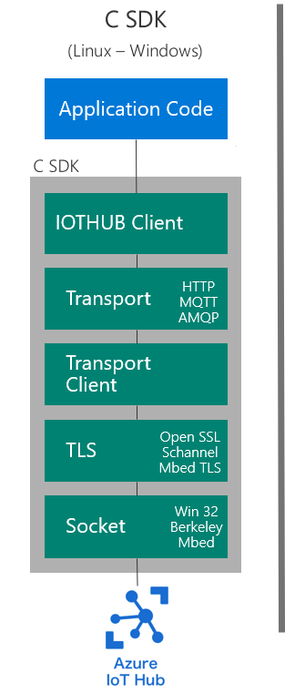

# Porting from Azure IoT C SDK to Middleware

This document gives some guidance on porting applications from the [Azure IoT C SDK](https://github.com/Azure/azure-iot-sdk-c) to this library (the Azure IoT middleware for FreeRTOS). Both SDKs were built with different intentions and concentrations, leading to different application approaches written by users. This document will go over the differences in architectures and what that means to use each SDK.

## Architectures

Below shows the high level differences in architectures between the two SDKs. Notice that all **green** boxes are handled and supported by Microsoft, while all **blue** boxes are handled by the user.

 

From the above pictures, a few key points should be kept in mind.

| Azure IoT C SDK | Azure IoT middleware for FreeRTOS |
| --------------- | --------------------------------- |
| Developed to be a vertically integrated stack (transport, TLS, TCP/IP) and handling Azure IoT features. | Developed to handle only only MQTT and Azure IoT features on top of MQTT. TLS and TCP/IP is handled by user. |
| Developed to support different operating systems. | Developed to support one platform/OS (FreeRTOS). |
| Supports three transport layers (MQTT, AMQP, and HTTP). | Supports only MQTT. |

Fundamentally what these differences mean is the following tradeoff.

| SDK | Pro | Con |
| --- | --- | --- |
| *Azure IoT C SDK* | Provides a fully integrated solution, working out of the box for all *supported* platforms. Simple "Connect" and "Send" user experience. | Porting is more complex for unsupported scenarios and with numerous supported OS's, networking, and transport layers, comes increased code size and decreased performance from various abstraction layers. |
| *Azure IoT middleware for FreeRTOS* | Embedded device focused architecture, increasing performance, reducing code size, and opening up freedom for users to bring their own networking implementations, uninhibited by strict abstraction layers. | Networking (TLS and TCP/IP) must be handled by the user and therefore requires acute knowledge of the platform for which you are porting. Guidance can be inferred from the samples but with greater flexibility comes more responsibility. |

## User Code for Azure IoT Hub

Let's look at some basic user level code for using Azure IoT Hub (no device provisioning) which one might write in both scenarios.

### Initialization

*Azure IoT C SDK* [taken from the iothub_ll_telemetry_sample](https://github.com/Azure/azure-iot-sdk-c/blob/master/iothub_client/samples/iothub_ll_telemetry_sample/iothub_ll_telemetry_sample.c):

```c
(void)IoTHub_Init();

IOTHUB_DEVICE_CLIENT_LL_HANDLE device_ll_handle;

// Create the iothub handle here
device_ll_handle = IoTHubDeviceClient_LL_CreateFromConnectionString(connectionString, MQTT_Protocol);

```

*Azure IoT middleware for FreeRTOS* [taken from the sample_azure_iot sample](https://github.com/Azure-Samples/iot-middleware-freertos-samples/blob/main/demos/sample_azure_iot/sample_azure_iot.c):

```c
ulStatus = prvConnectToServerWithBackoffRetries( ( const char * ) pucIotHubHostname,
                                                  democonfigIOTHUB_PORT,
                                                  &xNetworkCredentials, &xNetworkContext );
/* Fill in Transport Interface send and receive function pointers. */
xTransport.pxNetworkContext = &xNetworkContext;
xTransport.xSend = TLS_Socket_Send;
xTransport.xRecv = TLS_Socket_Recv;

xResult = AzureIoTHubClient_Init( &xAzureIoTHubClient,
                                  pucIotHubHostname, pulIothubHostnameLength,
                                  pucIotHubDeviceId, pulIothubDeviceIdLength,
                                  &xHubOptions,
                                  ucMQTTMessageBuffer, sizeof( ucMQTTMessageBuffer ),
                                  ullGetUnixTime,
                                  &xTransport );
```

Notice in the case of the Azure IoT C SDK, the full stack of networking is taken care of by Microsoft so you only need to initialize the client with a connection string containing your credentials and the protocol of your choice (MQTT, AMQP, or HTTP). After that point, you are ready to send telemetry messages or any use   other Azure IoT feature.

With the Azure IoT middleware for FreeRTOS, the initialization of the client requires the user to pass a network context for which the MQTT layer uses to send and receive MQTT messages. This means that the network context must be initialized by the user before passing to the middleware (in this case a static function called `prvConnectToServerWithBackoffRetries()` handles the initialization of that context). To see what that initialization entails, please see [the link here to the static function](https://github.com/Azure-Samples/iot-middleware-freertos-samples/blob/bea90b2a7ce11dc06612bdce142b90f59f436be1/demos/sample_azure_iot/sample_azure_iot.c#L558-L612).

If using x509 authentication, the client certificates, trusted server certs, and server endpoint must all be set using the guidance of the networking stack of your choosing. None of those are handled by the middleware. While this adds an extra step of complexity, this opens the door for easier integration of offloaded TLS stacks on modems or the freedom to use any software TLS or TCP/IP stack of your choosing; we do not interfere with any of those integrations as long as they conform to the requirements of the service (for TLS requirements, [please see here](https://docs.microsoft.com/azure/iot-hub/iot-hub-tls-support)).

### Sending Telemetry

*Azure IoT C SDK* [taken from the iothub_ll_telemetry_sample](https://github.com/Azure/azure-iot-sdk-c/blob/master/iothub_client/samples/iothub_ll_telemetry_sample/iothub_ll_telemetry_sample.c):

```c
message_handle = IoTHubMessage_CreateFromString(telemetry_msg);

// Add custom properties to message
(void)IoTHubMessage_SetProperty(message_handle, "property_key", "property_value");

IoTHubDeviceClient_LL_SendEventAsync(device_ll_handle, message_handle, send_confirm_callback, NULL);
```

*Azure IoT middleware for FreeRTOS* [taken from the sample_azure_iot sample](https://github.com/Azure-Samples/iot-middleware-freertos-samples/blob/main/demos/sample_azure_iot/sample_azure_iot.c):

```c
/* Create a bag of properties for the telemetry */
xResult = AzureIoT_MessagePropertiesInit( &xPropertyBag, ucPropertyBuffer, 0, sizeof( xPropertyBag ) );

xResult = AzureIoT_MessagePropertiesAppend( &xPropertyBag, ( uint8_t * ) "name", sizeof( "name" ) - 1,
                                            ( uint8_t * ) "value", sizeof( "value" ) - 1 );

xResult = AzureIoTHubClient_SendTelemetry( &xAzureIoTHubClient,
                                            ucScratchBuffer, ulScratchBufferLength,
                                            &xPropertyBag, eAzureIoTHubMessageQoS1, NULL );
```

Both scenarios give very similar experiences for creating a telemetry message with some properties and sending it. The difference here is the C SDK will send the message asynchronously (only to be sent during the call to `IoTHubDeviceClient_LL_DoWork()`) while the middleware will send it synchronously (sent on the wire if returned successfully). Both scenarios have the ability to be notified if the message was delivered successfully assuming you are using MQTT QOS 1. The Azure IoT C SDK allows the user to pass a callback to be notififed whereas the Azure IoT middleware for FreeRTOS allows for [an option to be set on client initialization](https://github.com/Azure/azure-iot-middleware-freertos/blob/fa1552c596f638d688a66f4cc4939e7b9ae49334/source/include/azure_iot_hub_client.h#L226-L227).


