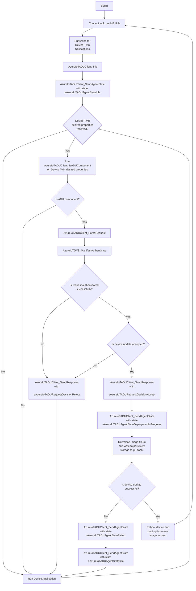

# How to use the ADU Agent Client in Azure IoT Middleware for FreeRTOS

Azure offers an over-the-air update (OTA) service called [Azure Device Update](https://learn.microsoft.com/azure/iot-hub-device-update/understand-device-update) (ADU).

This service can be used side-by-side with your Azure IoT Hub to update your device fleet.

You can see [this video](https://www.youtube.com/watch?v=eVRZi4bOXIQ&feature=youtu.be) with all the steps to experience OTA with ADU through the [samples](https://github.com/Azure-Samples/iot-middleware-freertos-samples#azure-device-update) available for Azure IoT Middleware for FreeRTOS.

This guide will show you how to use the ADU Agent client API in your device application to support OTA with ADU.

## Summary

- [Introduction](#introduction)
- [Azure Device Update in a Nutshell](#azure-device-update-in-a-nutshell)
  - [ADU Service](#adu-service)
  - [ADU Agent](#adu-agent)
- [Azure IoT Middleware for FreeRTOS ADU client API and ADU Agent Logic](#azure-iot-middleware-for-freertos-adu-client-api-and-adu-agent-logic)
  - [Flowchart of ADU Agent Logic](#flowchart-of-adu-agent-logic)
- [Support](#support)
- [Contributing](#contributing)
- [License](#license)
- [Trademarks](#trademarks)

## Azure Device Update in a Nutshell

Azure Device Update is implemented using a server-client architecture.

The components of the OTA update process using ADU are:
- the ADU Service
- the ADU Agent
- an update binary image
- its corresponding import manifest.

### ADU Service

The ADU service works in conjunction with Azure IoT Hub, leveraging the [Azure Device Twin feature](https://learn.microsoft.com/azure/iot-hub/iot-hub-devguide-device-twins) to deliver OTA update requests and consume ADU Agent state updates. It offers an user-interface through Azure Portal for customers to trigger, manage and monitor device updates.

To initiate an OTA update a customer would have a new binary image ready for their device(s) (with the new version of their code to update the device to), and [generate an ADU import manifest document](https://learn.microsoft.com/en-us/azure/iot-hub-device-update/update-manifest#import-manifest-vs-update-manifest) (which contains the name of that binary file plus additional details pertinent to the update process).

After uploading this import manifest to the ADU service and triggering the update, the ADU service delivers the update request (with the `import manifest` converted into what is called an `update manifest`) to the target device(s) by publishing that request in the device(s) Twin Document.

### ADU Agent

The ADU client API ("ADU Agent") provides functions to properly parse OTA update requests and provide state updates to the ADU service, on top of the Azure Device Twin feature as well.

Once a device boots up, the first step to make itself eligible to be updated through ADU (a.k.a, be an ADU Agent) is to send a state update to the ADU service informing the device details (e.g., manufacturer, model, etc), the version of the current device image and the ADU agent state (idle, in-progress, or error). 

Then the device application must wait for any Device Twin desired properties update, and check if the properties received are related to an ADU OTA update request (using one of the functions of the Azure IoT Middleware for FreeRTOS ADU client API). If it is an ADU OTA request, then the device application can parse, validate and use the request data for the OTA update. Once the update is completed, the device informs the ADU service about its ADU Agent state again and the new version of its image.

For more and in-depth details please refer to the [Azure Device Update official documentation](https://learn.microsoft.com/azure/iot-hub-device-update/understand-device-update).

## Azure IoT Middleware for FreeRTOS ADU client API and ADU Agent Logic

The Azure IoT Middleware for FreeRTOS ADU Client API is exposed by [azure_iot_adu_client.h](https://github.com/Azure/azure-iot-middleware-freertos/blob/main/source/include/azure_iot_adu_client.h).

Each of the functions in that header contain a full description of their functionality, arguments and return values.

For a device application to be recognized as an ADU Agent (and thus be able to be updated through ADU), the following sequence of events and function calls must occur:

1. The device must connect to the Azure IoT Hub and subscribe for Device Twin updates.

    Please refer to function `AzureIoTHubClient_SubscribeProperties` in [this sample code](https://github.com/Azure-Samples/iot-middleware-freertos-samples/blob/main/demos/sample_azure_iot_adu/sample_azure_iot_adu.c) for how to subscribe for Device Twin updates. 

1. Initialize the Azure Device Update client.

    Similar to the Azure IoT Hub client structure, the Azure Device Update client (`AzureIoTADUClient_t`) must also be initialized before it can be used with any of the functions below. For initializing it, call `AzureIoTADUClient_Init`.

1. Send the current ADU Agent state to the ADU Service.

    Call the function `AzureIoTADUClient_SendAgentState`, as shown in `prvAzureDemoTask` within [this sample code](https://github.com/Azure-Samples/iot-middleware-freertos-samples/blob/main/demos/sample_azure_iot_adu/sample_azure_iot_adu.c#L822).
    That will inform the ADU Service which device this is (manufacturer, model), the version of its image and the state (in this case that this device is ready to receive updates).

1. Then, each time a Device Twin Desired Properties message arrives, check if the properties contains a "deviceUpdate" component using `AzureIoTADUClient_IsADUComponent`.

    A device twin notification payload must be verified if the payload type is either `eAzureIoTHubPropertiesRequestedMessage` (resulting from a Device Twin GET request from the device client) or `eAzureIoTHubPropertiesRequestedMessage` (a Device Twin desired properties notification sent by the Azure IoT Hub). Please see an example with `AzureIoTADUClient_IsADUComponent` [here](https://github.com/Azure-Samples/iot-middleware-freertos-samples/blob/main/demos/sample_azure_iot_adu/sample_azure_iot_pnp_simulated_data.c#L483).

1. If `AzureIoTADUClient_IsADUComponent` returns true, the component in the Device Twin can be parsed into an usable data structure (`AzureIoTADUUpdateRequest_t`) using `AzureIoTADUClient_ParseRequest`.

    Note that the information in the request can be to start a new update, as well as to cancel an existing one.
    This can be verified through the property in `AzureIoTADUUpdateRequest_t.xWorkflow.xAction`, which will have either `eAzureIoTADUActionApplyDownload` (start a new update) or `eAzureIoTADUActionCancel`.
    If it is to start a new update, this data structure will contain the `ADU update manifest` document, a signature for validation, as well as link(s) for downloading the update image(s).

1. Next the device application must validate the `ADU update manifest`.

    The validation is done using function `AzureIoTJWS_ManifestAuthenticate` and the [Azure Device Update certificate root keys](https://learn.microsoft.com/azure/iot-hub-device-update/device-update-security#root-keys). An example of the usage of `AzureIoTJWS_ManifestAuthenticate` can be found in [sample_azure_iot_pnp_simulated_data.c](https://github.com/Azure-Samples/iot-middleware-freertos-samples/blob/main/demos/sample_azure_iot_adu/sample_azure_iot_pnp_simulated_data.c#L502).

1. Once validated, send a response to ADU Service accepting or rejecting the update request.

    This is done using `AzureIoTADUClient_SendResponse`, with either `eAzureIoTADURequestDecisionAccept` or `eAzureIoTADURequestDecisionReject` as response. Internally, this function publishes the response in the Device Twin reported properties, which are then read by the ADU Service.

    > A device could reject an update request if it is busy, for example. The ADU Agent will receive that same update request again later whenever it gets its Device Twin desired properties again (e.g., if it reboots).

    At this point the device application should exit the Device Twin notification function and process the update request within a separate task. That will allow the device to still receive other Device Twin notifications, with perhaps a cancellation if that is ever triggered by the user.
1. Send an ADU Agent state update to the ADU Service with an in-progress status.

    If the update request is for a new update and the device (ADU Agent) decides to accept it, call `AzureIoTADUClient_SendAgentState` with a `eAzureIoTADUAgentStateDeploymentInProgress` state to inform the ADU Service that the update is in progress.

1. Download update image(s) and write to Flash memory.

    The device application must iterate through the files in the update request, download them and write them to flash memory as applicable.

    The links to the binaries to be downloaded are stored in `AzureIoTADUUpdateRequest_t.pxFileUrls[]`.
    Each downloaded file shall be validated against its hash present in `AzureIoTADUUpdateRequest_t.xUpdateManifest.pxFiles[].pxHashes[]`.

    The Azure IoT Middleware for FreeRTOS provides an interface implemented on top of FreeRTOS' coreHTTP library to help download the binary files referenced in the update request. Header [azure_iot_http.h](https://github.com/Azure/azure-iot-middleware-freertos/blob/main/source/interface/azure_iot_http.h) exposes the following functions:
    - `AzureIoTHTTP_RequestSizeInit`
    - `AzureIoTHTTP_RequestSize`
    - `AzureIoTHTTP_Init`
    - `AzureIoTHTTP_Request`
    - `AzureIoTHTTP_Deinit`

    See `prvDownloadUpdateImageIntoFlash` in [sample_azure_iot_adu.c](https://github.com/Azure-Samples/iot-middleware-freertos-samples/blob/main/demos/sample_azure_iot_adu/sample_azure_iot_adu.c) for an example how to use these functions to download and write images to flash memory.

    > If an update fails (e.g., downloading the image files, or writing to flash), `AzureIoTADUClient_SendAgentState` must be called twice; once with state `eAzureIoTADUAgentStateFailed`, followed by another call with state `eAzureIoTADUAgentStateIdle` (with the same image version as before the update request).

1. Reboot device and load new image.

    At this point the device application must set the device to load the new image version upon reboot.
    This usually involves setting the bank or partition with the new image version (just downloaded) as active/enabled.

    Once that is done, the device application must restart and load the new image version.

    See `prvEnableImageAndResetDevice` in [sample_azure_iot_adu.c](https://github.com/Azure-Samples/iot-middleware-freertos-samples/blob/main/demos/sample_azure_iot_adu/sample_azure_iot_adu.c).

1. Send the ADU Agent state to the ADU Service.

    Once the device update is successfully completed the device application must inform the ADU Agent state to the ADU Service.

    This is also done with `AzureIoTADUClient_SendAgentState`.
    It will inform the ADU Service which device this is (manufacturer, model), the version of its new image (if successful) and that this device is ready to receive updates (state `eAzureIoTADUAgentStateIdle`).
    

### Flowchart of ADU Agent Logic

## Support

If you need support, please see our [SUPPORT.md](../SUPPORT.md) file.

## Contributing

This project welcomes contributions and suggestions.  Most contributions require you to agree to a
Contributor License Agreement (CLA) declaring that you have the right to, and actually do, grant us
the rights to use your contribution. For details, visit https://cla.opensource.microsoft.com.

When you submit a pull request, a CLA bot will automatically determine whether you need to provide
a CLA and decorate the PR appropriately (e.g., status check, comment). Simply follow the instructions
provided by the bot. You will only need to do this once across all repos using our CLA.

This project has adopted the [Microsoft Open Source Code of Conduct](https://opensource.microsoft.com/codeofconduct/).
For more information see the [Code of Conduct FAQ](https://opensource.microsoft.com/codeofconduct/faq/) or
contact [opencode@microsoft.com](mailto:opencode@microsoft.com) with any additional questions or comments.

## License

Azure IoT Middleware for FreeRTOS is licensed under the [MIT](https://github.com/Azure/azure-sdk-for-c/blob/main/LICENSE) license.

## Trademarks

This project may contain trademarks or logos for projects, products, or services. Authorized use of Microsoft 
trademarks or logos is subject to and must follow 
[Microsoft's Trademark & Brand Guidelines](https://www.microsoft.com/legal/intellectualproperty/trademarks/usage/general).
Use of Microsoft trademarks or logos in modified versions of this project must not cause confusion or imply Microsoft sponsorship.
Any use of third-party trademarks or logos are subject to those third-party's policies.
